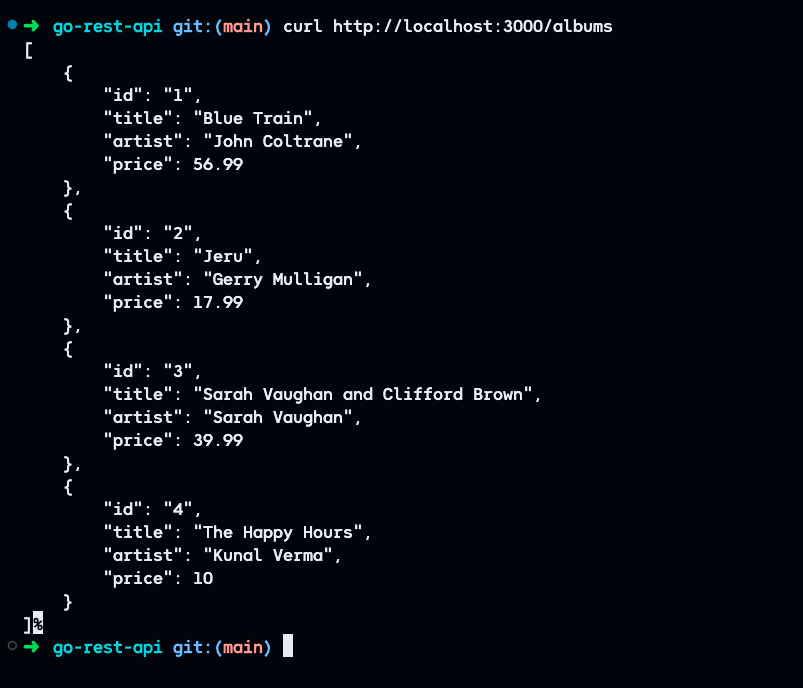

# Go REST API with Gin 

## Introduction 
This project is a simple **Go-based RESTful API** built with the [Gin Web Framework](https://gin-gonic.com/docs/quickstart/).

## Features

* RESTful API built with **Go** and **Gin**
* Demonstrates all **CRUD operations**
* Includes simple test suite for **unit testing**
* **Dockerized application** for easy deployment and scalability

## Prerequisites

Before getting started with this project, ensure you have the following dependencies installed:

- [Go (version 1.16+)](https://go.dev/doc/install)
- [Docker](https://www.docker.com/)

## Getting Started
### Setup the Project

To get started with this project, follow these steps:

1. **Clone the repository:**
    ```
    git clone https://gitlab.com/devops-projects6943118/ci-cd/go-rest-api.git
    ```

2. **Change into the project directory:**
    ```
    cd go-rest-api
    ```

3. **Install the dependencies:**
    ```
    go mod download
    ```
4. **Run the application:**

    - **Option 1: Run locally**
        ```
        go run main.go
        ```
    - **Option 2: Run with Docker**

        1. Build the image locally:

            ```
            docker build -t go-app .
            ```
        2. Run the docker container

            ```
            docker run -dp 3000:3000 go-app
            ```

- You can now access the app at: http://localhost:3000/albums

    
- To add am item to the list:

    ```
    curl http://localhost:3000/albums \
    --include \
    --header "Content-Type: application/json" \
    --request "POST" \
    --data '{"id": "5","title": "The Modern Sound of Betty Carter","artist": "Betty Carter","price": 49.99}'
    ```